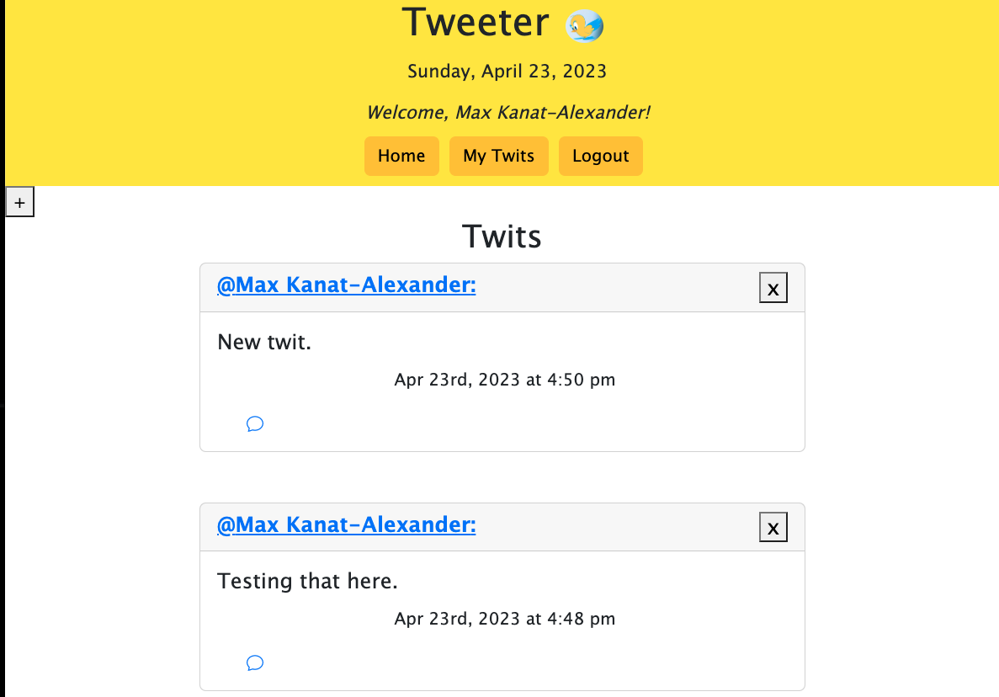

# Tweeter 

## Description
Tweeter is a micro-blogging application that allows you to post "Twits", view other's Twits, add comments, and so much more. 

The live application can be found here: https://tweeter-usk.herokuapp.com/ 

## Table of Contents
- [Installation](#installation)
- [Usage](#usage)
- [Credits](#credits)
- [License](#license)
- [Features](#features)
- [How to Contribute](#how-to-contribute)
- [Tests](#tests)
- [Questions](#questions)

## Installation
Download the files or clone the repo onto your local machine. To seed the database, run "npm run seed", then run "npm run build". Finally, run 'npm run develop' to start the server and navigate to the url. 

## Usage
Once you've navigated to the app, you should be able to view the twits of other users. You can navigate to a specific user's page to see all of their twits. Once you've registered and logged in, you can comment an on individual Twit or post your own Twit. 

## Credits
Githubs: 
@ColdWeatherBoyy
@SteviRoy
@keimdm
@lparr30
@BobbyCharms
@tatys5394
@Hshini

And a special thanks to Benjamin Wright, Max Ohsawa, and Sean Dillon for their ongoing support! 
https://chat.openai.com/ was used to explain concepts and help use debug. 

## License
N/A

## Features
You can register, log in, view Twits, view Comments, create your own Twit, delete your own Twits. 

## How to Contribute
Please reach out directly to one of the contributors or submit a pull request.       

## Tests
N/A

## Questions
Please use the below information to us via github: 

@ColdWeatherBoyy
@SteviRoy
@keimdm
@lparr30
@BobbyCharms
@tatys5394
@Hshini
